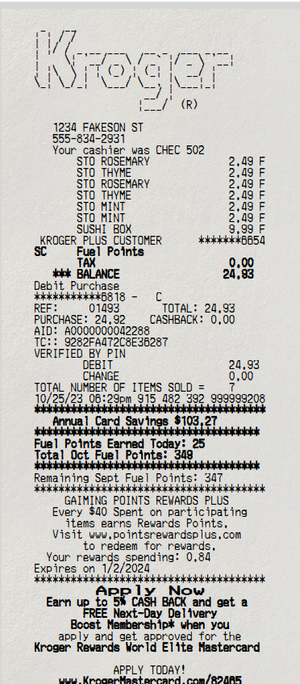

See the zine [here](https://za3k.github.io/ha3k-08-receipt)

Made for [hack-a-day](https://za3k.com/hackaday)

 

Thanks to:

- Merchant Copy (v1.0) font family, by [S. John Ross](www.cumberlandgames.com) © 2006. This font is freeware for private, non-commercial use. Contact him at sjohn@io.com if you're interested in an inexpensive commercial license.
- "Subtle Paper" background by [Pixeden](http://www.pixeden.com). Free for personal and non-commercial use.
